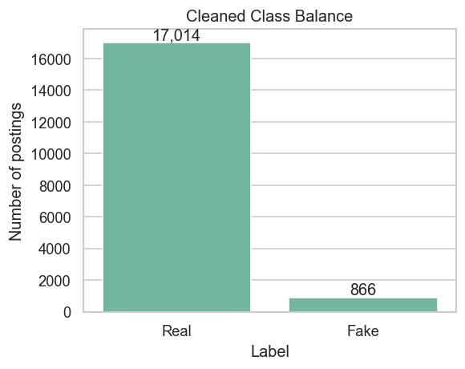
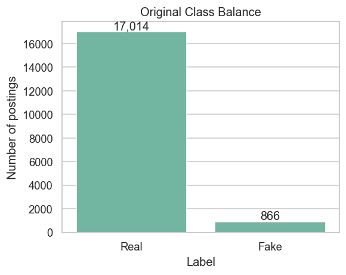
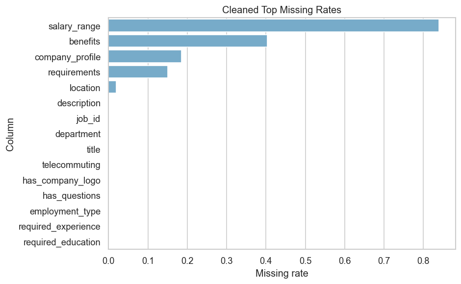
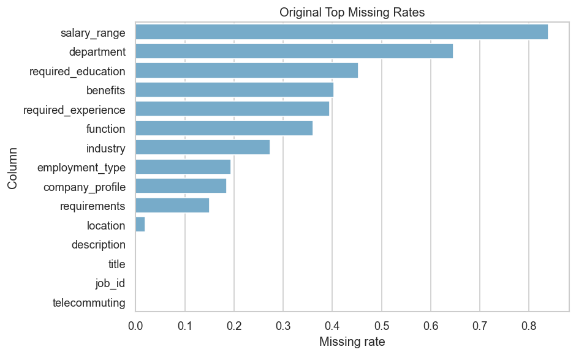
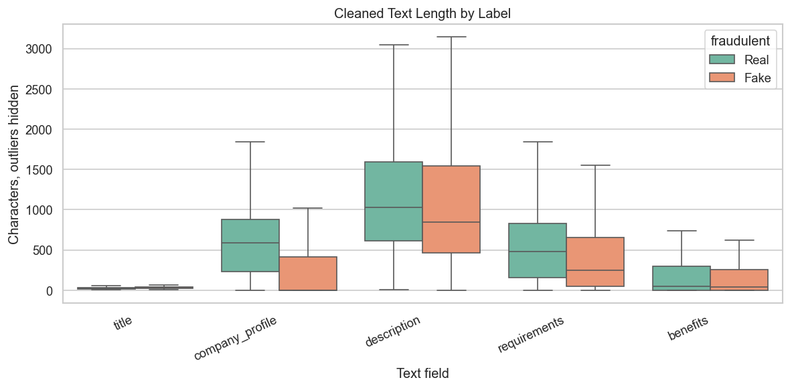
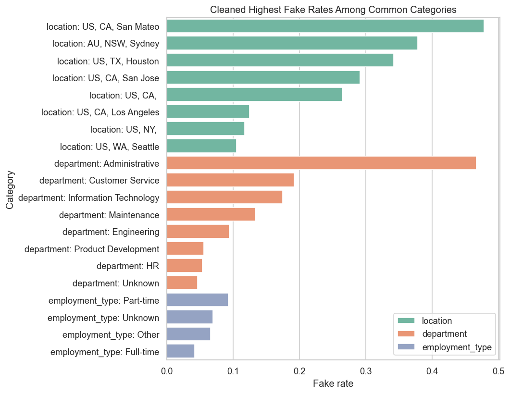
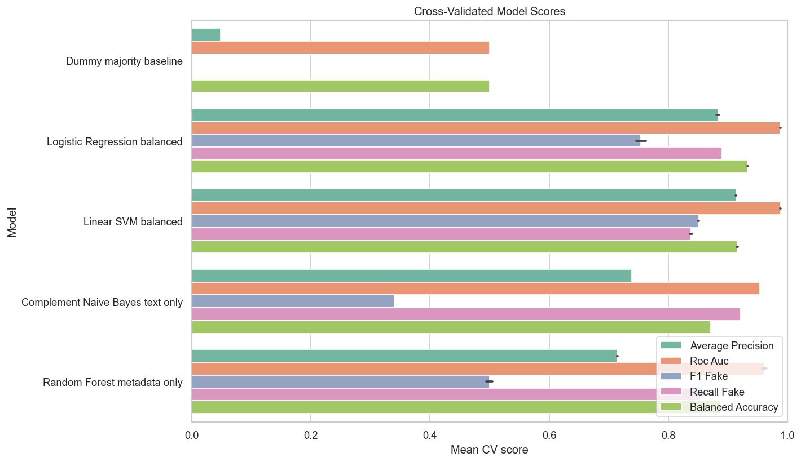
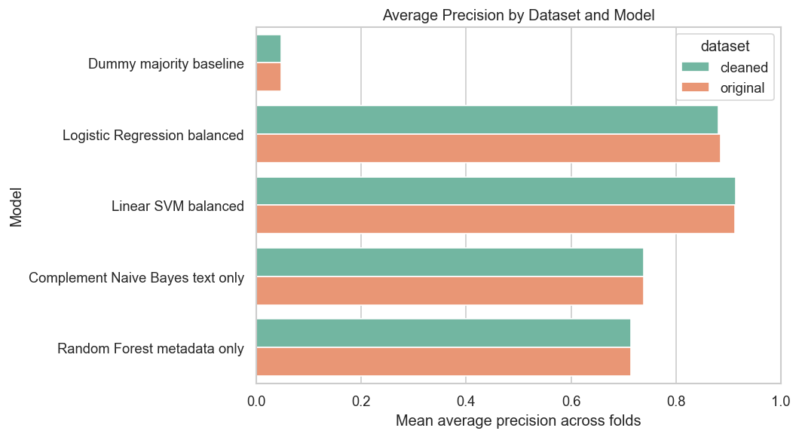
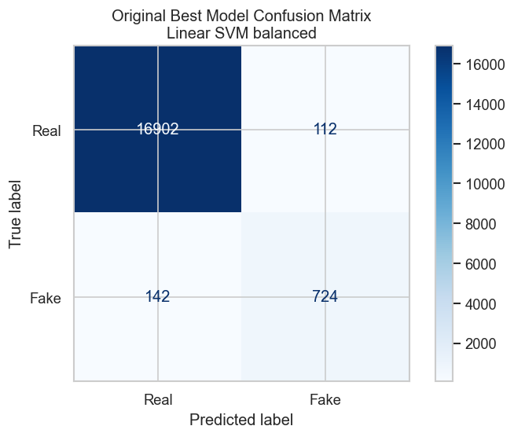

# Results and Analysis

This document summarizes the main findings from the fake job postings project. It is intended to be a readable companion to the full notebook outputs in `job_postings_eda_model_comparison.ipynb`.

## Executive Summary

The dataset is highly imbalanced: only about 4.84% of job postings are labeled fake. Because of that imbalance, accuracy is not a reliable headline metric. A majority-class baseline can reach about 95.16% accuracy while identifying zero fake postings.

The highest-performing classic model by average precision was a linear SVM using TF-IDF text features plus metadata. The cleaned and feature-engineered dataset performed only slightly better than the original dataset. This indicates that most of the predictive signal came from the original text fields.

For the recommended balanced Linear SVM on the cleaned data, fake-class precision was 86.36%, recall was 83.95%, and F1 was 85.12%. In practical terms, about 86 out of every 100 postings flagged as fake were actually fake, and the model caught about 84 out of every 100 fake postings in the dataset. The F1 score shows that these two abilities were reasonably well balanced.

The project is framed as follows:

**Fake job detection is not just a classification problem. It is an imbalanced classification problem where model selection depends on the precision-recall tradeoff for the rare fake class.**

## Research Questions

1. How imbalanced is the dataset, and why does that matter?
2. Is accuracy misleading for fake job detection?
3. Which classic machine learning model performs best on the minority fake class?
4. Does the cleaned and feature-engineered dataset improve model performance compared with the original dataset?
5. Which evaluation metric gives the most useful view of model performance?
6. What tradeoff exists between catching fake jobs and falsely flagging real jobs?
7. Do class-weighted models perform better than unweighted models on minority-class metrics?
8. Which words or metadata features appear most predictive of fraudulent postings?
9. What kinds of postings are most likely to become false positives or false negatives?

## Dataset Summary

| Dataset | Rows | Columns | Real Count | Fake Count | Fake Rate |
|---|---:|---:|---:|---:|---:|
| cleaned | 17,880 | 32 | 17,014 | 866 | 4.84% |
| original | 17,880 | 18 | 17,014 | 866 | 4.84% |

Full table: [dataset_summary.csv](results/tables/dataset_summary.csv)

### Class Balance

The imbalance is the core modeling issue. Since real postings dominate the data, a model can have high accuracy while still failing to detect fake postings.

## Missingness Analysis

### Cleaned Dataset Top Missing Rates

| Column | Missing Rate |
|---|---:|
| salary_range | 83.96% |
| benefits | 40.34% |
| company_profile | 18.50% |
| requirements | 15.08% |
| location | 1.94% |
| description | 0.01% |
| job_id | 0.00% |
| department | 0.00% |
| title | 0.00% |
| telecommuting | 0.00% |

Full table: [cleaned_missing_rates_top15.csv](results/tables/cleaned_missing_rates_top15.csv)

### Original Dataset Top Missing Rates

| Column | Missing Rate |
|---|---:|
| salary_range | 83.96% |
| department | 64.58% |
| required_education | 45.33% |
| benefits | 40.34% |
| required_experience | 39.43% |
| function | 36.10% |
| industry | 27.42% |
| employment_type | 19.41% |
| company_profile | 18.50% |
| requirements | 15.08% |

Full table: [original_missing_rates_top15.csv](results/tables/original_missing_rates_top15.csv)

The cleaned dataset reduced missingness in several categorical fields by filling values or engineering derived features. The model comparison results show that these changes produced only small performance differences compared with the original dataset.

## Text Length Patterns

Full text length summaries:

- [cleaned_text_length_summary.csv](results/tables/cleaned_text_length_summary.csv)
- [original_text_length_summary.csv](results/tables/original_text_length_summary.csv)

The highest-performing models used TF-IDF features from title, company profile, description, requirements, and benefits. This means the model comparison primarily evaluates text-based classification with additional metadata features.

## Categorical Fake Rates

Full categorical fake-rate tables:

- [cleaned_top_categorical_fake_rates.csv](results/tables/cleaned_top_categorical_fake_rates.csv)
- [original_top_categorical_fake_rates.csv](results/tables/original_top_categorical_fake_rates.csv)

Some categories had higher observed fake rates than others. These category-level rates describe the dataset distribution and may reflect dataset-specific patterns, small subgroup effects, or repeated postings.

## Cross-Validated Model Comparison

All models were evaluated with stratified 5-fold cross-validation. Average precision was used as the primary comparison metric because the positive class is rare and accuracy is affected by the majority real-posting class.

| Dataset | Model | Accuracy | Balanced Accuracy | ROC AUC | Average Precision | Fake Precision | Fake Recall | Fake F1 |
|---|---|---:|---:|---:|---:|---:|---:|---:|
| cleaned | Linear SVM balanced | 0.9858 | 0.9164 | 0.9890 | 0.9140 | 0.8636 | 0.8395 | 0.8512 |
| cleaned | Logistic Regression balanced | 0.9706 | 0.9325 | 0.9884 | 0.8810 | 0.6430 | 0.8903 | 0.7464 |
| cleaned | Complement Naive Bayes text only | 0.8261 | 0.8714 | 0.9539 | 0.7387 | 0.2084 | 0.9215 | 0.3398 |
| cleaned | Random Forest metadata only | 0.9145 | 0.8899 | 0.9651 | 0.7145 | 0.3469 | 0.8626 | 0.4947 |
| cleaned | Dummy majority baseline | 0.9516 | 0.5000 | 0.5000 | 0.0484 | 0.0000 | 0.0000 | 0.0000 |
| original | Linear SVM balanced | 0.9858 | 0.9147 | 0.9880 | 0.9128 | 0.8665 | 0.8361 | 0.8508 |
| original | Logistic Regression balanced | 0.9730 | 0.9338 | 0.9876 | 0.8850 | 0.6666 | 0.8903 | 0.7620 |
| original | Complement Naive Bayes text only | 0.8261 | 0.8714 | 0.9539 | 0.7387 | 0.2084 | 0.9215 | 0.3398 |
| original | Random Forest metadata only | 0.9199 | 0.8845 | 0.9569 | 0.7143 | 0.3604 | 0.8453 | 0.5053 |
| original | Dummy majority baseline | 0.9516 | 0.5000 | 0.5000 | 0.0484 | 0.0000 | 0.0000 | 0.0000 |

Full table: [cv_model_comparison.csv](results/tables/cv_model_comparison.csv)

### Interpretation

The dummy baseline shows why accuracy is misleading for this dataset. It achieved 95.16% accuracy, but fake recall and fake F1 were both 0.00 because the model never predicted the fake class.

The balanced Linear SVM had the highest average precision in both dataset versions. Balanced Logistic Regression had higher fake recall than the balanced Linear SVM, but lower fake precision. Complement Naive Bayes had high fake recall and low fake precision, which means it predicted many postings as fake and produced more false positives.

## Highest Average Precision Model Classification Reports

The model with the highest average precision for both datasets was the balanced Linear SVM.

| Dataset | Class | Precision | Recall | F1 | Support |
|---|---|---:|---:|---:|---:|
| cleaned | Real | 0.9918 | 0.9932 | 0.9925 | 17,014 |
| cleaned | Fake | 0.8634 | 0.8395 | 0.8513 | 866 |
| original | Real | 0.9917 | 0.9934 | 0.9925 | 17,014 |
| original | Fake | 0.8660 | 0.8360 | 0.8508 | 866 |

Full table: [best_model_classification_reports.csv](results/tables/best_model_classification_reports.csv)

### What Precision, Recall, and F1 Mean in This Project

The fake class is treated as the positive class. Therefore, all three metrics below describe the model's ability to identify fraudulent postings rather than its ability to identify the much more common legitimate postings.

- **Fake precision** answers: *Of the postings the model flagged as fake, how many were actually fake?* The balanced Linear SVM's fake precision was 0.8636, or 86.36%. Thus, approximately 86 of every 100 flags were correct. The remaining flags were false positives: legitimate postings sent for review by mistake.

- **Fake recall** answers: *Of all the fake postings in the dataset, how many did the model catch?* Recall was 0.8395, or 83.95%. Thus, the model detected approximately 84 of every 100 fake postings. The remaining fake postings were false negatives that the model incorrectly allowed through as real.

- **Fake F1** combines fake precision and fake recall into one score using their harmonic mean:

  `F1 = 2 x (precision x recall) / (precision + recall)`

  The balanced Linear SVM's fake F1 was 0.8512, or 85.12%. A high F1 requires both precision and recall to be strong; one cannot fully compensate for a very weak value of the other. Here, the F1 score indicates a strong and fairly even balance between catching fraudulent postings and avoiding false alarms.

### Confusion Matrix Interpretation

At the default SVM decision threshold of 0.0000, the out-of-fold predictions across all 17,880 cleaned records produced the following counts:

| Outcome | Count | Meaning |
|---|---:|---|
| True positive | 727 | Fake posting correctly flagged as fake |
| False positive | 115 | Real posting incorrectly flagged as fake |
| False negative | 139 | Fake posting incorrectly predicted as real |
| True negative | 16,899 | Real posting correctly predicted as real |

These counts provide a concrete interpretation of the metrics. Precision is `727 / (727 + 115) = 86.34%`, because 727 of the 842 fake flags were correct. Recall is `727 / (727 + 139) = 83.95%`, because the model caught 727 of the 866 genuinely fake postings. Small differences between the displayed precision values of 0.8634 and 0.8636 come from averaging scores across the five cross-validation folds versus calculating the score once from all combined out-of-fold predictions.

### Why Accuracy Is Not Enough

Only 866 of the 17,880 postings, or 4.84%, are fake. A model that labels every posting as real therefore obtains 95.16% accuracy while catching no fraud at all. This is exactly what the dummy majority baseline did: it had 95.16% accuracy but fake precision, fake recall, and fake F1 of 0.00.

The balanced Linear SVM's 98.58% accuracy is useful supporting information, but its fake precision, recall, and F1 are more informative because they directly measure performance on the rare class that the project is trying to detect.

## Weighted vs Unweighted Linear Models

| Dataset | Model | Average Precision | Fake Precision | Fake Recall | Fake F1 |
|---|---|---:|---:|---:|---:|
| cleaned | Linear SVM unweighted | 0.9181 | 0.9301 | 0.7933 | 0.8559 |
| cleaned | Linear SVM balanced | 0.9140 | 0.8636 | 0.8395 | 0.8512 |
| cleaned | Logistic Regression balanced | 0.8810 | 0.6430 | 0.8903 | 0.7464 |
| cleaned | Logistic Regression unweighted | 0.8679 | 0.9292 | 0.6340 | 0.7527 |
| original | Linear SVM unweighted | 0.9168 | 0.9361 | 0.7910 | 0.8570 |
| original | Linear SVM balanced | 0.9128 | 0.8665 | 0.8361 | 0.8508 |
| original | Logistic Regression balanced | 0.8850 | 0.6666 | 0.8903 | 0.7620 |
| original | Logistic Regression unweighted | 0.8680 | 0.9316 | 0.6271 | 0.7487 |

Full table: [weighted_vs_unweighted_linear_models.csv](results/tables/weighted_vs_unweighted_linear_models.csv)

### Interpretation

Class weighting changed the model's prediction behavior. The unweighted Linear SVM produced fewer fake predictions, which resulted in higher fake precision and lower fake recall. The balanced Linear SVM produced more fake predictions, which resulted in higher fake recall and lower fake precision.

## Precision-Recall Curves

The precision-recall curves show how fake-class precision and fake-class recall change across decision thresholds. This view is relevant because the positive class is rare and the default threshold is only one possible operating point.

## Feature Interpretation

The selected linear model can be inspected through feature coefficients. Positive coefficients push predictions toward fake, while negative coefficients push predictions toward real.

### Top Features Associated With Fake Postings

| Feature | Coefficient |
|---|---:|
| text: link | 2.0230 |
| category: department_Information Technology | 1.5334 |
| category: location_US, TX, AUSTIN | 1.5306 |
| category: location_US, OH, Groveport | 1.4451 |
| text: money | 1.4260 |
| category: department_Sales and Research | 1.3807 |
| text: american | 1.3081 |
| text: duration | 1.2949 |
| text: earn | 1.2023 |
| category: department_Biotech | 1.1549 |
| text: sigma | 1.1481 |
| category: location_US, RI, Middletown | 1.1442 |

Full table: [top_features_associated_with_fake.csv](results/tables/top_features_associated_with_fake.csv)

### Top Features Associated With Real Postings

| Feature | Coefficient |
|---|---:|
| text: client | -1.1843 |
| text: experience | -1.1665 |
| text: basic computer | -1.1084 |
| text: english | -1.0241 |
| text: growing | -0.9402 |
| text: companies | -0.9377 |
| text: fun | -0.9375 |
| text: expected | -0.9135 |
| text: 50 | -0.9019 |
| category: industry_Restaurants | -0.8988 |
| text: search | -0.8710 |
| text: consultants | -0.8582 |

Full table: [top_features_associated_with_real.csv](results/tables/top_features_associated_with_real.csv)

These coefficients describe how the fitted Linear SVM used the available features in this dataset. Positive coefficients moved predictions toward the fake class, while negative coefficients moved predictions toward the real class. The coefficients are dataset-specific model outputs, not universal indicators of fraud.

## Error Analysis

Error analysis was performed on cross-validated predictions from the cleaned dataset using the balanced Linear SVM model. The analysis used the model's predicted label and decision score for each row.

### Error Counts

| Error Type | Count |
|---|---:|
| False positives | 115 |
| False negatives | 139 |

Full tables:

- [cleaned_best_model_error_summary.csv](results/tables/cleaned_best_model_error_summary.csv)
- [cleaned_best_model_false_positives.csv](results/tables/cleaned_best_model_false_positives.csv)
- [cleaned_best_model_false_negatives.csv](results/tables/cleaned_best_model_false_negatives.csv)

False positives are real postings predicted as fake. False negatives are fake postings predicted as real.

### Four-Group Error Summary

The expanded error analysis separated predictions into four groups:

- True positives: fake postings predicted as fake.
- False negatives: fake postings predicted as real.
- False positives: real postings predicted as fake.
- True negatives: real postings predicted as real.

| Prediction Group | Count | Mean Score for Fake | Mean Title Chars | Mean Description Chars | Mean Requirements Chars | Mean Company Profile Chars | Company Logo Rate | Questions Rate | Salary Range Rate | Benefits Rate | Company Profile Rate |
|---|---:|---:|---:|---:|---:|---:|---:|---:|---:|---:|---:|
| True positive | 727 | 0.938 | 31.171 | 1154.351 | 441.301 | 245.927 | 0.338 | 0.275 | 0.248 | 0.589 | 0.331 |
| False negative | 139 | -0.545 | 28.029 | 1157.367 | 470.885 | 152.252 | 0.266 | 0.360 | 0.309 | 0.532 | 0.273 |
| False positive | 115 | 0.289 | 26.722 | 981.330 | 404.330 | 121.391 | 0.183 | 0.322 | 0.330 | 0.487 | 0.165 |
| True negative | 16,899 | -1.746 | 28.433 | 1222.852 | 598.780 | 644.287 | 0.823 | 0.503 | 0.154 | 0.598 | 0.845 |

Full table: [cleaned_error_group_feature_summary.csv](results/tables/cleaned_error_group_feature_summary.csv)

Interpretation: among real postings, the rows incorrectly predicted as fake had lower company logo and company profile rates than the rows correctly predicted as real. The false-positive group also had shorter average descriptions, requirements, company profiles, and benefits than the true-negative group. Among fake postings, the rows missed by the model had negative decision scores, which is why they were predicted as real.

### Categorical Error Patterns

The notebook also summarized the most frequent categorical values within each prediction group for industry, function, employment type, required experience, and required education.

Full table: [cleaned_error_group_top_categories.csv](results/tables/cleaned_error_group_top_categories.csv)

This table summarizes categorical values within each prediction group. It shows whether false positives, false negatives, true positives, or true negatives are concentrated in specific industries, job functions, employment types, or education/experience categories.

### Example-Level Error Review

The example-level table contains selected false positive and false negative rows with job title, metadata, model score, description snippet, and a short rule-based note describing observable properties of the row.

Full table: [cleaned_error_examples_for_discussion.csv](results/tables/cleaned_error_examples_for_discussion.csv)

This table provides row-level examples of model errors. It complements the aggregate error counts, feature summaries, and category summaries.

### Error Rates by Binary Feature Presence

Error rates were calculated separately for binary metadata features. For each feature value, the false positive rate was calculated among real postings and the false negative rate was calculated among fake postings.

| Feature | Value | Rows | False Positive Rate Among Real | False Negative Rate Among Fake |
|---|---:|---:|---:|---:|
| has_company_logo | 0 | 3,660 | 0.0305 | 0.1750 |
| has_company_logo | 1 | 14,220 | 0.0015 | 0.1307 |
| has_questions | 0 | 9,088 | 0.0092 | 0.1445 |
| has_questions | 1 | 8,792 | 0.0043 | 0.2000 |
| has_salary_range | 0 | 15,012 | 0.0054 | 0.1493 |
| has_salary_range | 1 | 2,868 | 0.0144 | 0.1928 |
| has_benefits | 0 | 7,212 | 0.0086 | 0.1786 |
| has_benefits | 1 | 10,668 | 0.0055 | 0.1474 |
| has_company_profile | 0 | 3,308 | 0.0353 | 0.1721 |
| has_company_profile | 1 | 14,572 | 0.0013 | 0.1362 |
| has_department | 0 | 11,547 | 0.0068 | 0.1751 |
| has_department | 1 | 6,333 | 0.0067 | 0.1373 |
| telecommuting | 0 | 17,113 | 0.0065 | 0.1596 |
| telecommuting | 1 | 767 | 0.0128 | 0.1719 |

Full table: [cleaned_binary_feature_error_rates.csv](results/tables/cleaned_binary_feature_error_rates.csv)

Interpretation: among real postings, the false positive rate was higher when `has_company_logo = 0` than when `has_company_logo = 1`. The same pattern appeared for `has_company_profile`: real postings without a company profile had a higher false positive rate than real postings with a company profile. Among fake postings, false negative rates also varied by binary feature value, but the largest contrast in this table is the false positive rate for missing logo/profile information.

### Error Rates by Text Length Bucket

Text length buckets were created for title, description, requirements, company profile, and benefits. Within each bucket, false positive and false negative rates were calculated.

Full table: [cleaned_text_length_bucket_error_rates.csv](results/tables/cleaned_text_length_bucket_error_rates.csv)

Interpretation: among real postings, the shortest company profile bucket had a higher false positive rate than longer company profile buckets. Among fake postings, false negative rates varied across text fields and length buckets. No single text-length field fully explains which fake postings were missed.

### Score Distribution by Prediction Group

The balanced Linear SVM decision score was summarized by prediction group.

| Prediction Group | Count | Mean | Median | Std. Dev. | Min | Max |
|---|---:|---:|---:|---:|---:|---:|
| True positive | 727 | 0.9380 | 0.9534 | 0.4736 | 0.0042 | 2.7637 |
| False negative | 139 | -0.5447 | -0.4215 | 0.4260 | -2.4067 | -0.0090 |
| False positive | 115 | 0.2891 | 0.1980 | 0.2916 | 0.0045 | 1.8085 |
| True negative | 16,899 | -1.7461 | -1.7392 | 0.6197 | -4.3400 | -0.0024 |

Full table: [cleaned_score_summary_by_prediction_group.csv](results/tables/cleaned_score_summary_by_prediction_group.csv)

Interpretation: false positives had positive decision scores because they were predicted as fake, but their average score was lower than the average score for true positives. False negatives had negative decision scores because they were predicted as real, but the least negative false negatives were close to the zero threshold. This shows that some errors were near the decision boundary, while other errors were made with higher model confidence.

### Most Confident Mistakes and Borderline Cases

The most confident mistakes were identified by sorting false positives by highest fake-class score and false negatives by lowest fake-class score. Borderline cases were identified by the smallest absolute distance from the default threshold of zero.

Full tables:

- [cleaned_most_confident_mistakes.csv](results/tables/cleaned_most_confident_mistakes.csv)
- [cleaned_borderline_cases.csv](results/tables/cleaned_borderline_cases.csv)
- [cleaned_least_confident_correct_cases.csv](results/tables/cleaned_least_confident_correct_cases.csv)

Interpretation: the most confident false positives are real postings with the highest positive fake-class scores. The most confident false negatives are fake postings with the most negative fake-class scores. Borderline cases are postings with scores closest to zero; these cases are most likely to change predicted class when the threshold changes.

### Error Analysis Output Inventory

All generated error-analysis outputs are listed below.

Tables:

- [cleaned_best_model_error_summary.csv](results/tables/cleaned_best_model_error_summary.csv)
- [cleaned_best_model_false_positives.csv](results/tables/cleaned_best_model_false_positives.csv)
- [cleaned_best_model_false_negatives.csv](results/tables/cleaned_best_model_false_negatives.csv)
- [cleaned_error_group_feature_summary.csv](results/tables/cleaned_error_group_feature_summary.csv)
- [cleaned_error_group_top_categories.csv](results/tables/cleaned_error_group_top_categories.csv)
- [cleaned_error_examples_for_discussion.csv](results/tables/cleaned_error_examples_for_discussion.csv)
- [cleaned_binary_feature_error_rates.csv](results/tables/cleaned_binary_feature_error_rates.csv)
- [cleaned_text_length_bucket_error_rates.csv](results/tables/cleaned_text_length_bucket_error_rates.csv)
- [cleaned_score_summary_by_prediction_group.csv](results/tables/cleaned_score_summary_by_prediction_group.csv)
- [cleaned_most_confident_mistakes.csv](results/tables/cleaned_most_confident_mistakes.csv)
- [cleaned_borderline_cases.csv](results/tables/cleaned_borderline_cases.csv)
- [cleaned_least_confident_correct_cases.csv](results/tables/cleaned_least_confident_correct_cases.csv)
- [cleaned_threshold_tradeoff_balanced_linear_svm.csv](results/tables/cleaned_threshold_tradeoff_balanced_linear_svm.csv)
- [final_model_recommendation_tradeoff.csv](results/tables/final_model_recommendation_tradeoff.csv)

Figures:

- [cleaned_best_model_confusion_matrix.png](results/figures/cleaned_best_model_confusion_matrix.png)
- [cleaned_error_group_counts.png](results/figures/cleaned_error_group_counts.png)
- [cleaned_error_group_feature_rates.png](results/figures/cleaned_error_group_feature_rates.png)
- [cleaned_binary_feature_error_rates.png](results/figures/cleaned_binary_feature_error_rates.png)
- [cleaned_text_length_bucket_false_positive_rate_among_real.png](results/figures/cleaned_text_length_bucket_false_positive_rate_among_real.png)
- [cleaned_text_length_bucket_false_negative_rate_among_fake.png](results/figures/cleaned_text_length_bucket_false_negative_rate_among_fake.png)
- [cleaned_score_distribution_by_prediction_group_boxplot.png](results/figures/cleaned_score_distribution_by_prediction_group_boxplot.png)
- [cleaned_score_distribution_by_prediction_group_density.png](results/figures/cleaned_score_distribution_by_prediction_group_density.png)
- [cleaned_threshold_tradeoff_counts.png](results/figures/cleaned_threshold_tradeoff_counts.png)
- [cleaned_threshold_tradeoff_precision_recall_f1.png](results/figures/cleaned_threshold_tradeoff_precision_recall_f1.png)

## Threshold Analysis

Threshold analysis was performed using the balanced Linear SVM decision scores on cross-validated predictions from the cleaned dataset. Each threshold produced a different number of postings predicted as fake.

| Threshold | Flagged Rate | True Positives | False Positives | False Negatives | Fake Precision | Fake Recall | Fake F1 |
|---:|---:|---:|---:|---:|---:|---:|---:|
| -0.9649 | 0.1500 | 839 | 1,843 | 27 | 0.3128 | 0.9688 | 0.4729 |
| -0.7289 | 0.1000 | 823 | 965 | 43 | 0.4603 | 0.9503 | 0.6202 |
| -0.5056 | 0.0750 | 807 | 534 | 59 | 0.6018 | 0.9319 | 0.7313 |
| -0.0870 | 0.0500 | 742 | 152 | 124 | 0.8300 | 0.8568 | 0.8432 |
| 0.0000 | 0.0471 | 727 | 115 | 139 | 0.8634 | 0.8395 | 0.8513 |
| 0.2374 | 0.0400 | 670 | 46 | 196 | 0.9358 | 0.7737 | 0.8470 |
| 0.6742 | 0.0300 | 527 | 10 | 339 | 0.9814 | 0.6085 | 0.7512 |

Full table: [cleaned_threshold_tradeoff_balanced_linear_svm.csv](results/tables/cleaned_threshold_tradeoff_balanced_linear_svm.csv)

Interpretation: as the threshold decreased, more postings were predicted as fake. This increased fake recall and also increased false positives. As the threshold increased, fewer postings were predicted as fake. This increased fake precision and also increased false negatives. At the default threshold of 0.0000, the model produced 727 true positives, 115 false positives, and 139 false negatives. At -0.9649, fake recall increased to 0.9688 and fake precision decreased to 0.3128. At 0.6742, fake precision increased to 0.9814 and fake recall decreased to 0.6085.

## Balanced vs Unweighted Linear SVM Tradeoff

| Model | Average Precision | Fake Precision | Fake Recall | Fake F1 | Balanced Accuracy | Interpretation |
|---|---:|---:|---:|---:|---:|---|
| Linear SVM balanced | 0.9140 | 0.8636 | 0.8395 | 0.8512 | 0.9164 | Higher fake recall |
| Linear SVM unweighted | 0.9181 | 0.9301 | 0.7933 | 0.8559 | 0.8951 | Higher fake precision |

Full table: [final_model_recommendation_tradeoff.csv](results/tables/final_model_recommendation_tradeoff.csv)

Interpretation: the balanced Linear SVM had higher fake recall than the unweighted Linear SVM. The unweighted Linear SVM had higher fake precision and slightly higher fake F1. The balanced model predicted more fake postings, while the unweighted model made fewer fake predictions.

## Original vs Cleaned Dataset

| Dataset | Best Model | Average Precision | ROC AUC | Fake F1 | Fake Recall | Fake Precision |
|---|---|---:|---:|---:|---:|---:|
| cleaned | Linear SVM balanced | 0.9140 | 0.9890 | 0.8512 | 0.8395 | 0.8636 |
| original | Linear SVM balanced | 0.9128 | 0.9880 | 0.8508 | 0.8361 | 0.8665 |

Full table: [top_model_by_dataset.csv](results/tables/top_model_by_dataset.csv)

The cleaned dataset performed only slightly better than the original dataset. This result indicates that the original text fields carried most of the predictive signal. The engineered features supported EDA and interpretation, but they did not substantially change model performance.

## Final Conclusions

1. The class imbalance is central to the project. Only 4.84% of postings are fake.
2. Accuracy is misleading. The dummy majority baseline reaches 95.16% accuracy while detecting no fake postings.
3. Linear SVM models had the highest average precision values in the model comparison.
4. Class weighting changes the precision-recall tradeoff. Balanced models had higher fake-class recall, while unweighted models had higher fake-class precision.
5. The cleaned dataset only slightly improves performance compared with the original.
6. Average precision, fake-class recall, fake-class precision, and fake-class F1 provide more information than accuracy for model selection on this imbalanced dataset.
7. Threshold analysis showed that lower thresholds increased fake recall and false positives, while higher thresholds increased fake precision and false negatives.

## Summary Claim

The results show that fake job posting detection is an imbalanced classification problem. Accuracy alone does not show whether a model detects the rare fake class. Stratified cross-validation, minority-class metrics, threshold analysis, and error analysis provide a more complete evaluation of model performance.
